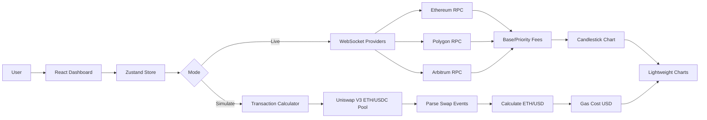

# Cross-Chain Gas Price Tracker

A real-time blockchain gas price monitoring and transaction cost simulation dashboard built with React, TypeScript, and ethers.js.

## 🌟 Features

### Real-Time Gas Monitoring
- **Multi-chain support**: Ethereum, Polygon, and Arbitrum
- **WebSocket connections** to native RPC endpoints for live updates
- **15-minute candlestick charts** showing gas price volatility
- **Real-time ETH/USD pricing** from Uniswap V3 on-chain data

### Transaction Simulation
- **Cross-chain cost comparison** for any transaction amount
- **Dynamic gas calculations** including base fees and priority fees
- **USD cost estimates** with live ETH pricing
- **Cheapest chain recommendations**

### Advanced Features
- **Zustand state management** with live/simulation modes
- **Beautiful crypto-themed UI** with gradients and animations
- **Responsive design** optimized for all devices
- **Error handling** and connection status monitoring

## 🚀 Live Demo

[View Live Demo](https://lovable.dev/projects/e3febc98-b58b-4431-90ec-c395933219be) 

## 🏗️ Architecture



## 🛠️ Technology Stack

- **Frontend**: React 18 + TypeScript
- **State Management**: Zustand
- **Blockchain**: ethers.js v6
- **Charts**: lightweight-charts
- **UI**: shadcn/ui + Tailwind CSS
- **Build Tool**: Vite

## 📊 Key Components

### GasWidget
Displays real-time gas prices for each blockchain with:
- Current gas price in gwei
- Base fee and priority fee breakdown
- USD cost for standard transfers
- Connection status indicator
- Trend analysis with visual indicators

### ChartWidget
Interactive candlestick chart featuring:
- 15-minute interval gas price data
- Chain selection dropdown
- Gas price volatility visualization
- USD value overlay line

### SimulationPanel
Transaction cost calculator with:
- Amount and gas limit inputs
- Cross-chain cost comparison
- Real-time USD calculations
- Cheapest chain recommendations

### BlockchainService
Core service handling:
- WebSocket connections to multiple chains
- Real-time block monitoring
- Uniswap V3 price feed integration
- Gas price aggregation and storage

## 🔧 Installation & Setup

### Prerequisites
- Node.js 18+ and npm
- Git

### Clone & Install
```bash
# Clone the repository
git clone <YOUR_GIT_URL>
cd cross-chain-gas-tracker

# Install dependencies
npm install

# Start development server
npm run dev
```

### RPC Configuration
The app uses demo RPC endpoints by default. For production use, replace with your own:

```typescript
// src/store/gasStore.ts
ethereum: {
  rpcUrl: 'wss://eth-mainnet.g.alchemy.com/v2/YOUR_KEY',
},
polygon: {
  rpcUrl: 'wss://polygon-mainnet.g.alchemy.com/v2/YOUR_KEY',
},
arbitrum: {
  rpcUrl: 'wss://arb-mainnet.g.alchemy.com/v2/YOUR_KEY',
}
```

## 💡 Key Implementation Details

### ETH/USD Price Calculation
```typescript
// Direct Uniswap V3 pool interaction
const poolContract = new ethers.Contract(UNISWAP_V3_POOL, POOL_ABI, provider);
const slot0 = await poolContract.slot0();

// Calculate price from sqrtPriceX96
const price = (sqrtPrice ** 2 * (10 ** 6)) / (2 ** 192 * 10 ** 18);
const ethUsdPrice = 1 / price; // Invert for ETH/USD
```

### Gas Cost Calculation
```typescript
// Transaction cost calculation
const totalGasPrice = baseFee + priorityFee;
const gasCostETH = (totalGasPrice * gasLimit) / 1e9; // Convert gwei to ETH
const gasCostUSD = gasCostETH * ethUsdPrice;
const totalCostUSD = (gasCostETH + transactionAmount) * ethUsdPrice;
```

### State Management
Zustand store with mode switching:
- **Live Mode**: Real-time WebSocket updates
- **Simulation Mode**: Static calculations for cost comparison

## 🎨 Design System

The app features a crypto-focused design with:
- **Dark theme** optimized for trading interfaces
- **Gradient backgrounds** and glow effects
- **Semantic color tokens** for different chains
- **Responsive grid layouts**
- **Smooth animations** and transitions

### Color Palette
- **Primary**: Blue (#00D4FF) - Ethereum theme
- **Success**: Green (#22C55E) - Arbitrum theme  
- **Warning**: Orange (#F59E0B) - Polygon theme
- **Background**: Dark grey gradients

## 📈 Performance Features

- **Efficient WebSocket management** with automatic reconnection
- **Data aggregation** for chart performance
- **Memoized calculations** to prevent unnecessary re-renders
- **Optimized chart rendering** with lightweight-charts
- **Responsive image optimization**

## 🔒 Security Considerations

- **Read-only operations** - no wallet connections required
- **Public RPC endpoints** - no private keys exposed
- **Client-side only** - no backend dependencies
- **CORS-compliant** API interactions

## 📱 Responsive Design

The dashboard is fully responsive:
- **Mobile**: Stacked layout with touch-friendly controls
- **Tablet**: 2-column grid with collapsible sidebar
- **Desktop**: Full 4-column layout with side-by-side panels

## 🧪 Testing & Development

### Development Commands
```bash
npm run dev          # Start development server
npm run build        # Build for production
npm run preview      # Preview production build
npm run type-check   # TypeScript type checking
```

### Browser Requirements
- Modern browsers with WebSocket support
- JavaScript enabled
- Minimum screen width: 320px

## 🚀 Deployment

### Automatic Deployment
Changes pushed to the main branch automatically deploy via Lovable's GitHub integration.

### Manual Deployment
```bash
npm run build
# Deploy dist/ folder to your hosting provider
```

### Environment Variables
No environment variables required for basic functionality. Optional Alchemy API keys can be configured for enhanced RPC access.

## 🤝 Contributing

1. Fork the repository
2. Create a feature branch
3. Implement changes with tests
4. Submit a pull request

## 📄 License

MIT License - see LICENSE file for details.

## 🙏 Acknowledgments

- **ethers.js** for blockchain connectivity
- **Uniswap V3** for on-chain price feeds
- **shadcn/ui** for component library
- **lightweight-charts** for chart visualization
- **Zustand** for state management

## 📞 Support

For issues or questions:
1. Check existing GitHub issues
2. Create a new issue with detailed description
3. Join our Discord community

---

**Built with ❤️ for the DeFi community**